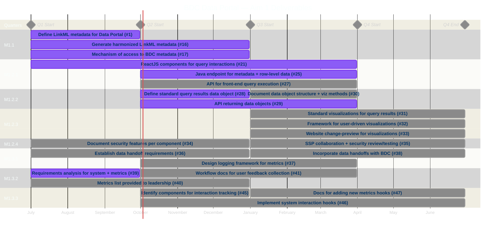

# Development Overview

This repository is the reporting spine for Aim 1 of the BDC Data Portal project. It holds
the funding deliverables and the work breakdown beneath them. Implementation happens in
other repositories and links back here.

# How work rolls up

Four tiers. Only the first three live in this repository.

| Tier | Artifact | Example |
|---|---|---|
| Deliverable | Milestone | `M1.1: BDC computational metadata "source of truth" with semantic bindings` |
| Sub-deliverable | `Epic` issue | `M1.1a: Definition of structured LinkML metadata required for Data Portal` |
| Story | `Story` issue | `M1.1a-T13: Document ICD/CPT code sets for HTN and T2D cohort identification` |
| Implementation | issue in a work repository | `tis-lab/study-palette#33` |

**The rule: an issue counts toward a deliverable if and only if it is linked to an issue in
this repository.** Link to the lowest tier that already exists — don't create a Story just to
have somewhere to hang an issue. Native sub-issue links are preferred; where GitHub can't
make the link, a `Tracking`-labelled issue carrying the reference in its body does the same job.

Closing an implementation issue advances its Story, which advances its Epic, which advances
the milestone. Nothing else needs to be updated for a report to be correct.

## Repositories

**Owned** — work here is in scope by default, and an unlinked issue is a gap:

- [`tis-lab/study-palette`](https://github.com/tis-lab/study-palette) — Meta-Analysis Study Builder & Query Tool
- [`tis-lab/bdc-dp-core`](https://github.com/tis-lab/bdc-dp-core) — Data Portal app framework and context providers
- [`tis-lab/bdc-dp-middleware`](https://github.com/tis-lab/bdc-dp-middleware) — Java middleware API
- `tis-lab/BDC-Portal` — this repository

**Coordinated** — these repositories serve other purposes, and most of their issues are
correctly outside this project. Work lands here only when it is the right home for something
that serves a deliverable, and it participates by being linked:

- [`tis-lab/monarch-bdc-kg`](https://github.com/tis-lab/monarch-bdc-kg) — BDC extension of the Monarch KG
- [`tis-lab/BDC-VarLib`](https://github.com/tis-lab/BDC-VarLib) — variable library
- [`linkml/dm-bip`](https://github.com/linkml/dm-bip) — ingestion pipeline
- [`RTIInternational/NHLBI-BDC-DMC-HM`](https://github.com/RTIInternational/NHLBI-BDC-DMC-HM) — harmonized data model
- [`RTIInternational/NHLBI-BDC-DMC-HV`](https://github.com/RTIInternational/NHLBI-BDC-DMC-HV) — harmonized variables and transform specs

Silence from a coordinated repository is the expected state, not a finding.

## What this repository does not own

Due dates, status, sprint assignment, and quarter fields on the
[project board](https://github.com/orgs/tis-lab/projects/7) belong to the project managers.
Contributors close issues; they do not set status. Some reporting is tracked outside GitHub
entirely. Nothing in this document needs to agree with a sprint boundary.

# Project Roadmap

**Note:** Quarters are derived from the M1.1 milestone due date of 2026-09-30 and the
July 2026 project kick-off, placing Q1 at 2026-07-01 – 2026-09-30. Confirm against the
award period before relying on Q3/Q4 dates.

# Deliverables

Each heading is a milestone. Each item is an Epic issue.

## M1.1: BDC computational metadata "source of truth" with semantic bindings

- [ ] [#1](https://github.com/tis-lab/BDC-Portal/issues/1) — Definition of structured LinkML metadata required for Data Portal (Q1)
- [ ] [#16](https://github.com/tis-lab/BDC-Portal/issues/16) — Generation of harmonized LinkML metadata files by DMC Data Ingestion (Q1–Q2)
- [ ] [#17](https://github.com/tis-lab/BDC-Portal/issues/17) — Identify mechanism of access to BDC computational metadata (Q1–Q2)

## M1.2.1: Open-source library of reusable interface components

- [ ] [#21](https://github.com/tis-lab/BDC-Portal/issues/21) — ReactJS components allowing for user interactions with query components (Q1–Q3)
- [ ] [#25](https://github.com/tis-lab/BDC-Portal/issues/25) — Java-based endpoint capable of accessing metadata files and row-level BDC data (Q2–Q3)
- [ ] [#27](https://github.com/tis-lab/BDC-Portal/issues/27) — API capable of processing of front-end interactions to execute query against BDC (Q2–Q3)

## M1.2.2: Open-source library of reusable APIs

- [ ] [#28](https://github.com/tis-lab/BDC-Portal/issues/28) — Definition of standard data object for query results (Q2)
- [ ] [#29](https://github.com/tis-lab/BDC-Portal/issues/29) — API capable of returning data objects (Q2–Q3)
- [ ] [#30](https://github.com/tis-lab/BDC-Portal/issues/30) — Documentation of data object structure and methods to add data scope for data visualizations (Q3)

## M1.2.3: Open-source library of visualization widgets

- [ ] [#31](https://github.com/tis-lab/BDC-Portal/issues/31) — Creation of standard visualizations for all query results (Q3–Q4)
- [ ] [#32](https://github.com/tis-lab/BDC-Portal/issues/32) — Definition of framework for adding additional user-driven visualizations (Q3–Q4)
- [ ] [#33](https://github.com/tis-lab/BDC-Portal/issues/33) — Website change-preview feature for visualization changes (Q3–Q4) — not in the original workplan

## M1.2.4: Design and implement security and compliance features

- [ ] [#34](https://github.com/tis-lab/BDC-Portal/issues/34) — Document security and compliance features for each component and its integration into BDC (Q1–Q2)
- [ ] [#35](https://github.com/tis-lab/BDC-Portal/issues/35) — Collaborate with NIH on SSP and on security review/testing of newly implemented components (Q3–Q4)

## M1.3.1: Standardized, logged, transportable query results for use in the BDC ecosystem

- [ ] [#36](https://github.com/tis-lab/BDC-Portal/issues/36) — Establish requirements of data handoffs to other BDC components (Q1–Q2)
- [ ] [#37](https://github.com/tis-lab/BDC-Portal/issues/37) — Design of logging framework based on metrics requirements (Q2–Q3)
- [ ] [#38](https://github.com/tis-lab/BDC-Portal/issues/38) — Incorporate data handoffs with BDC components into Data Portal (Q3–Q4)

## M1.3.2: Formal requirements analysis for interfaces and workflows

- [ ] [#39](https://github.com/tis-lab/BDC-Portal/issues/39) — Requirements analysis to define desired system functionality and metrics (Q1)
- [ ] [#40](https://github.com/tis-lab/BDC-Portal/issues/40) — List of metrics with descriptions generated from requirements analysis, provided to leadership (Q1–Q2)
- [ ] [#41](https://github.com/tis-lab/BDC-Portal/issues/41) — Workflow documentation on submission of intended user feedback collection (Q2–Q3)

Cohort use-case work ([#42](https://github.com/tis-lab/BDC-Portal/issues/42),
[#43](https://github.com/tis-lab/BDC-Portal/issues/43),
[#44](https://github.com/tis-lab/BDC-Portal/issues/44)) sits under this milestone as Stories
rather than Epics — it is numbered `d`/`e`/`f` but does not correspond to a workplan row.

## M1.3.3: Interface hooks to collect system interactions to generate user metrics

- [ ] [#45](https://github.com/tis-lab/BDC-Portal/issues/45) — Identification of relevant interface components to attach hooks for interaction tracking (Q2)
- [ ] [#46](https://github.com/tis-lab/BDC-Portal/issues/46) — Initial implementation of system interaction hooks for prioritized metrics (Q2–Q4)
- [ ] [#47](https://github.com/tis-lab/BDC-Portal/issues/47) — Supporting documentation for addition of new hooks for additional metrics collection (Q3–Q4)
